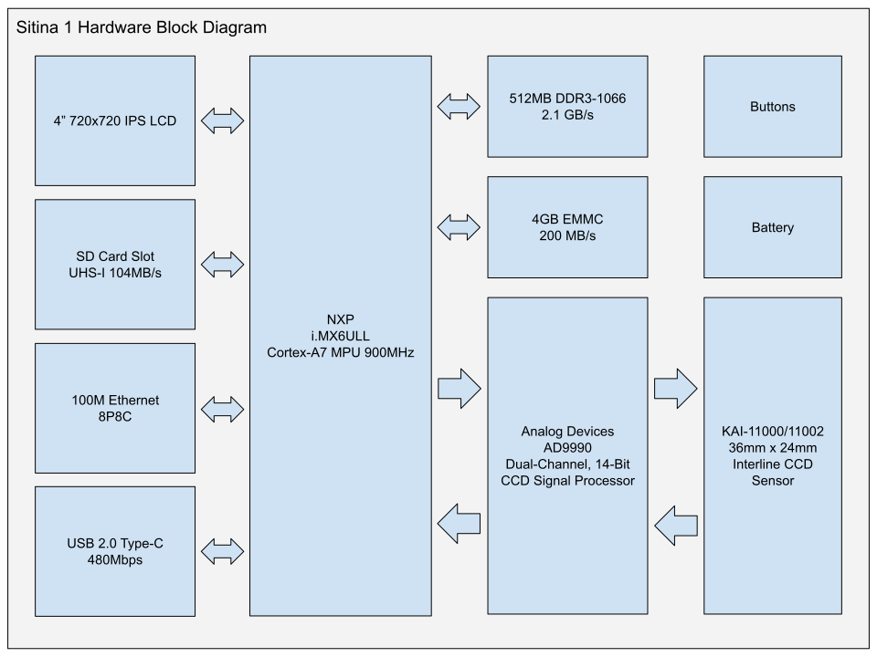

# Sitina 1

Open-source 35mm full-frame (36mm x 24mm) CCD mirror-less interchangable lens camera (MILC). The original goal of this project was to create a digital camera back to convert SLR cameras to DSLR cameras, but has since changed to build a full MILC. See also Sitina 2.

## Specifications

The following are preliminary.

### Hardware

- Processor: NXP i.MX6 ULL (900MHz Cortex-A7)
- RAM: 512MB 16-bit DDR3-1066 (2GB/s)
- OS Storage: 4GB eMMC
- AFE: Analog Devices AD9990
- Sensor: Kodak/ONsemi KAI-11000/KAI-11002M/CM
- User Expansion:
  - microSD slot (UHS-I, 104MB/s)
  - USB Type-C (USB 2.0 HS, 480Mbps)
  - USB Micro-B (USB serial debugging)
  - 100M Ethernet
  - Flash sync terminal

### Camera Features

The following are possible with hardware, but not necessarily supported by the current software.

- Sensor Type: 35mm Interline CCD sensor
- Sensor Size: 36.0 x 24.0 mm
- Effective Pixels: 10.7MP
- Lens Mount: Active FE mount
- Still Resolutions:
  - 4008x2672 10.7MP 3:2
  - 3563x2672 9.5MP 4:3 1.08X crop
  - 2672x2672 7.1MP 1:1 1.27X crop
  - 2782x1856 5.2MP 3:2 APS-C crop
  - 2676x2007 5.4MP 4:3 APS-C crop
  - 2365x2365 5.6MP 1:1 APS-C crop
- Still Format:
  - DNG (10/12/14-bit lossless compressed RAW)
  - JPEG
- Readout Speed:
  - 4008x2672 at 5FPS (can be reduced to 2.5FPS)
  - 4008x480 at 28FPS (line skipping live view, rescaled to 720x480 for output)
- Movie recording is not supported.
- ISO:
  - TBD

## Status

Harware R0.4 soldered and mostly working. R0.5 working in progress. See schematics for change logs.